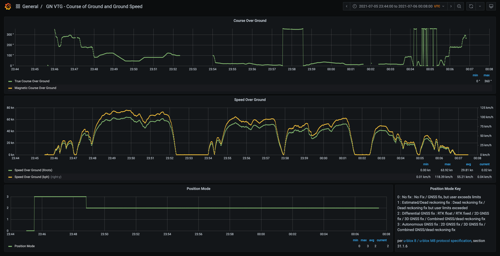
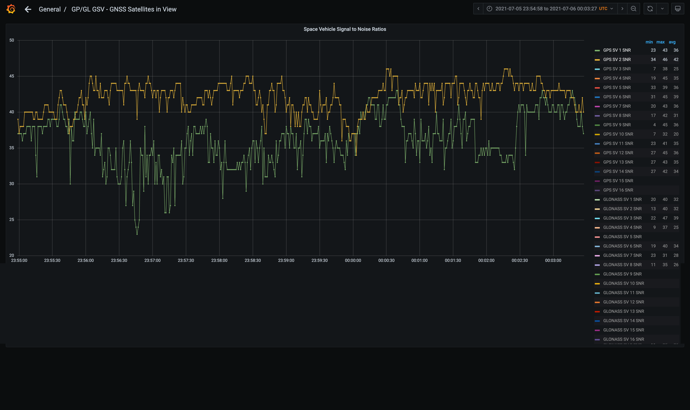

This library makes use of [pynmea2](https://github.com/Knio/pynmea2) to parse through input NMEA 0183 data, organize it, and output it to CSV files or to a PostgreSQL database.

## Table of Contents
1. [Terminology](#terminology)
1. [Setup](#setup)
1. [Usage](#usage)
1. [Examples](#examples)
1. [Development Notes/Oddities](#development-notes-and-oddities)
1. [Helpful References](#helpful-references)
1. [Grafana](#grafana)
1. [Discussion](#discussion)


## Support
If you find this tool useful, please consider supporting its development and the development of other tools like it. You can support us financially using the `Sponsor` button at the top of the [GitHub page](https://github.com/Petrichor-Labs/nmea_data_convert).

## Terminology
* **`sentence`**:
A line from your GNSS module/NMEA data file from a particular `talker` and of a particular `sentence type` E.g.:
  - `$GNRMC,,V,,,,,,,,,,N*4D`
  - `$GNGGA,045824.00,3944.54025,N,10511.64604,W,1,03,4.93,1784.2,M,-21.5,M,,*49`

* **`talker`**:
The type of the transmitting unit. For the purposes of satellite navigation, this is the constellation from which data is being received.
E.g.:
  - `GA`: Galileo Positioning System
  - `GB`: BDS (BeiDou System)
  - `GL`: GLONASS Receiver
  - `GN`: Global Navigation Satellite System (GNSS)
  - `GP`: Global Positioning System (GPS)
  
  See: https://gpsd.gitlab.io/gpsd/NMEA.html#_talker_ids, or https://www.nmea.org/Assets/20190303%20nmea%200183%20talker%20identifier%20mnemonics.pdf

* **`sentence type`**:
One of several types of NMEA sentences that can be received from the talker.
E.g.:
  - `RMC`
  - `VTG`
  - `GGA`
  - `GSA`
  - `GSV`
  - `GLL`
  
  See: https://gpsd.gitlab.io/gpsd/NMEA.html#_nmea_standard_sentences

* **`sentence cycle`**:
A set of sentences output by a GNSS module on each iteration. For example, a module operating on a 1Hz cycle may output a set of sentences at the top of every second that looks like this:
  ```
  $GNRMC,045832.00,A,3944.53039,N,10511.64401,W,0.875,,221220,,,A*7A
  $GNVTG,,T,,M,0.875,N,1.621,K,A*33
  $GNGGA,045832.00,3944.53039,N,10511.64401,W,1,07,1.55,1785.9,M,-21.5,M,,*42
  $GNGSA,A,3,19,02,14,28,24,06,,,,,,,2.77,1.55,2.30*1B
  $GNGSA,A,3,73,,,,,,,,,,,,2.77,1.55,2.30*1A
  $GPGSV,2,1,06,02,33,205,20,06,68,161,23,14,26,115,23,19,70,010,15*7B
  $GPGSV,2,2,06,24,42,282,26,28,37,109,22*75
  $GLGSV,1,1,03,73,85,280,31,74,33,326,,,,,31*61
  $GNGLL,3944.53039,N,10511.64401,W,045832.00,A,A*68
  ```

## Setup

Input data files can contain either sentences having all the same `talker`+`sentence_type`, like that of `test_data/test_data_0_GLGSV.nmea`, `test_data_0_GNGGA.nmea`, etc., or cycles of sentences like that of `test_data/test_data_0_all.nmea`. Your input file should have a format similiar to those under `test_data`.

To have your data datetime stamped, it must be in a format like that of `test_data/test_data_0_all.nmea`, with RMC sentences containing date and time stamps proceeding other sentences in the same cycle. 

Usage of the `cycle_start` (`cs`), `num_sentences_per_cycle` (`spc`), and `backfill_datetimes` (`bfdt`) parameters will depend on the format of your data, and some combination of them is required. See below for examples. See the Usage section for explanations of the parameters.


To import data to a Postgres database, have the database server installed and running where desired. The database access information/credentials must be setup in `db_creds.py`.


## Usage
```
$ cd nmea_data_convert/
$ pip install -r requirements.txt 
...
$ python nmea_data_convert.py --help
usage: nmea_data_convert.py [-h] [--cycle_start CYCLE_START] [--num_sentences_per_cycle NUM_SENTENCES_PER_CYCLE] [--backfill_datetimes] [--drop_previous_db_tables] filepath {csv,db,both}

positional arguments:
  filepath              file system path to file containing NMEA data
  {csv,db,both}         where to output data: CSV files, database, or both

optional arguments:
  -h, --help            show this help message and exit
  --cycle_start CYCLE_START, -cs CYCLE_START
                        talker+sentence_type, e.g. 'GNRMC'; used to key off of for sentence merging, and more; must appear once and only once in each cycle, and must be at the beginning of each cycle; must contain date and time information for sentences to be datetime
                        stamped
  --num_sentences_per_cycle NUM_SENTENCES_PER_CYCLE, -spc NUM_SENTENCES_PER_CYCLE
                        If the cycle_start argument is not provided, and sentences are not all of type GSV, cycles will be inferred from this argument. Every num_sentences_per_cycle will be given the same cycle_id starting with the first sentence. Sentence merging is
                        based on cycle_id.
  --backfill_datetimes, -bfdt
                        backfill datetimes where missing by extrapolating from messages with datetime information
  --drop_previous_db_tables, -dropt
                        drop all previous DB tables before importing new data; only applies when output_method is 'db' or 'both'
```
## Examples
### Example 1
Output cycles of NMEA sentences to CSV files using GNRMC sentences as the cycle start:
```
$ ls -l *.csv
ls: *.csv: No such file or directory
$ python nmea_data_convert.py test_data/test_data_0_all.nmea csv -cs GNRMC

Reading in data... done.

Processing data... done.

Writing data to CSVs... data from logfile 'test_data/test_data_0_all.nmea' written to:
  test_data_0_all_GNRMC.csv
  test_data_0_all_GNVTG.csv
  test_data_0_all_GNGGA.csv
  test_data_0_all_GNGSA.csv
  test_data_0_all_GPGSV.csv
  test_data_0_all_GLGSV.csv
  test_data_0_all_GNGLL.csv
done.

All done. Exiting.


MacBook-Pro-4:nmea_data_convert Thomas$ ls -l *.csv
-rw-r--r--  1 Thomas  staff  16166 Jan 17 16:55 test_data_0_all_GLGSV.csv
-rw-r--r--  1 Thomas  staff  12067 Jan 17 16:55 test_data_0_all_GNGGA.csv
-rw-r--r--  1 Thomas  staff   9401 Jan 17 16:55 test_data_0_all_GNGLL.csv
-rw-r--r--  1 Thomas  staff  14136 Jan 17 16:55 test_data_0_all_GNGSA.csv
-rw-r--r--  1 Thomas  staff  12536 Jan 17 16:55 test_data_0_all_GNRMC.csv
-rw-r--r--  1 Thomas  staff   8344 Jan 17 16:55 test_data_0_all_GNVTG.csv
-rw-r--r--  1 Thomas  staff  20698 Jan 17 16:55 test_data_0_all_GPGSV.csv
```

### Example 2
Output cycles of NMEA sentences to both CSV files and database using GNRMC sentences as the cycle start, backfill datetimes, and drop previous tables from database:
```
$ python nmea_data_convert.py test_data/test_data_0_all.nmea both -bfdt -dropt -cs GNRMC

Reading in data... done.

Processing data... done.

Writing data to CSVs... data from logfile 'test_data/test_data_0_all.nmea' written to:
  test_data_0_all_GNRMC.csv
  test_data_0_all_GNVTG.csv
  test_data_0_all_GNGGA.csv
  test_data_0_all_GNGSA.csv
  test_data_0_all_GPGSV.csv
  test_data_0_all_GLGSV.csv
  test_data_0_all_GNGLL.csv
done.

Dropping database table nmea_gl_gsv (and any dependent objects) if it exists.
Dropping database table nmea_gn_gga (and any dependent objects) if it exists.
Dropping database table nmea_gn_gll (and any dependent objects) if it exists.
Dropping database table nmea_gn_gsa (and any dependent objects) if it exists.
Dropping database table nmea_gn_rmc (and any dependent objects) if it exists.
Dropping database table nmea_gn_vtg (and any dependent objects) if it exists.
Dropping database table nmea_gp_gsv (and any dependent objects) if it exists.

Writing data to database... data from logfile 'test_data/test_data_0_all.nmea' written to:
  'nmea_gn_rmc' table in 'nmea_data' database
  'nmea_gn_vtg' table in 'nmea_data' database
  'nmea_gn_gga' table in 'nmea_data' database
  'nmea_gn_gsa' table in 'nmea_data' database
  'nmea_gp_gsv' table in 'nmea_data' database
  'nmea_gl_gsv' table in 'nmea_data' database
  'nmea_gn_gll' table in 'nmea_data' database
done.

All done. Exiting.
```

### Example 3
Convert sentences, all of the same `talker`+`sentence_type`, to database:
```
$ python nmea_data_convert.py test_data/test_data_0_GNVTG.nmea db -spc 1

Reading in data... done.

Processing data... done.

Writing data to database... data from logfile 'test_data/test_data_0_GNVTG.nmea' written to:
  'nmea_gn_vtg' table in 'nmea_data' database
done.

All done. Exiting.

```

### Example 4
Convert GSV sentences, all of the same `talker`, to database, where there may sometimes be multiple messages from the same cycle. In this case, cycles must start with the sentence having the `msg_num` field equal to `1` (see `test_data/test_data_0_GPGSV.nmea`:
```
$ python nmea_data_convert.py test_data/test_data_0_GPGSV.nmea db
[output excluded for brevity]
```

### Example 5
Convert GSA sentences, all of the same `talker`, to database, where each sentence is part of a cycle containing two GSA sentences. Cycles may contain a GSA sentence for each constellation (see `test_data/test_data_0_GNGSA.nmea`:
```
$ python nmea_data_convert.py test_data/test_data_0_GNGSA.nmea db -spc 2
[output excluded for brevity]
```

## Development Notes and Oddities
- Sentence cycles contain a variable number of GPGSV sentences. A single GPGSV sentence contains information for 0-4 GPS satellites. A GNSS receiver could see up to 16 GPS satellites (https://stackoverflow.com/a/16415858/2909854, that may apply only on the ground?), resulting in up to four GPGSV sentences in a single cycle, e.g.:
  ```
  ...
  $GPGSV,4,1,13,08,14,320,33,10,57,295,34,13,01,038,,15,26,049,35*7B
  $GPGSV,4,2,13,18,60,119,41,23,68,019,34,24,29,097,35,27,36,294,27*71
  $GPGSV,4,3,13,29,01,170,,32,31,211,34,46,38,215,36,48,40,210,37*73
  $GPGSV,4,4,13,51,44,184,40*46
  ...
  ```
  Columns used in the dataframes, CSV output, and database output are mostly determined by what is returned from pynmea2. For GPGSV sentences, we use `expand_GSV_fields()` to always create columns for up to 16 satellites in view. This way, the correct columns will exist in the appropriate database table and can be used to hold data from different and varying NMEA data sets. In the future, to make the database handling more dynamic, we could move to using something like Binary JSON instead.

## Helpful References
* https://github.com/Knio/pynmea2/blob/master/README.md
* https://www.u-blox.com/sites/default/files/products/documents/u-blox8-M8_ReceiverDescrProtSpec_%28UBX-13003221%29.pdf (section 31 'NMEA Protocol')
* https://www.sparkfun.com/datasheets/GPS/NMEA%20Reference%20Manual1.pdf
* https://www.trimble.com/OEM_ReceiverHelp/V4.44/en/NMEA-0183messages_MessageOverview.html
* Talker Identifiers : https://www.nmea.org/Assets/20190303%20nmea%200183%20talker%20identifier%20mnemonics.pdf
* Glossary : https://www.unavco.org/help/glossary/glossary.html
* https://gpsd.gitlab.io/gpsd/NMEA.html#_nmea_standard_sentences

## Grafana
One of the great advantages of importing this data into a database is that you can use a system like [Grafana](https://github.com/grafana/grafana) to visualize it. Below are screenshots of the included Grafana dashboards showing the data parsed from `test_data/test_data_4.nmea` using this tool. These dashboards have been found to work in Grafana v7.5.7, but not in v8.0.4.








## Discussion
For any questions, feedback, or other discussion items, please feel free to post in the [`Discussions` tab on the GitHub page](https://github.com/Petrichor-Labs/nmea_data_convert/discussions).